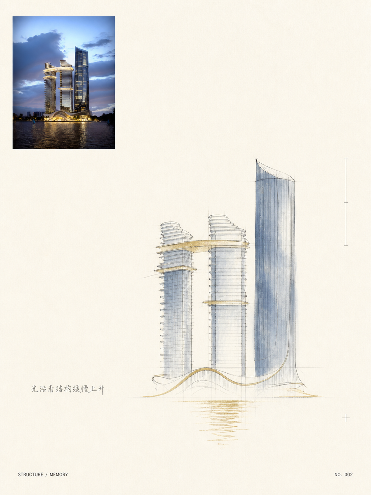
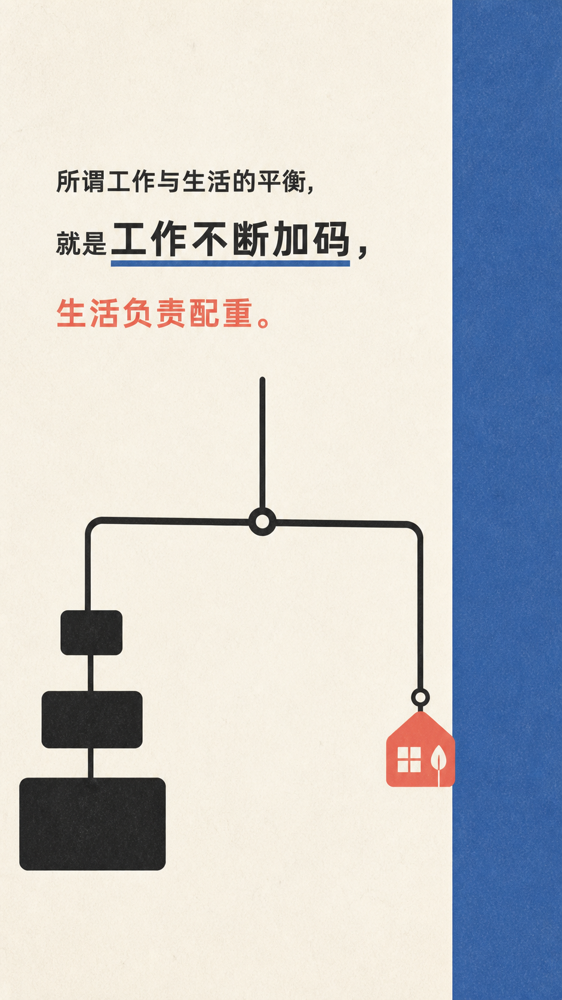

# Visual Memory Translator / 影像转译编辑器

[中文](#中文) · [English](#english) · [Gallery](#gallery)

> **原图是现实记录，新图是记忆转译。**  
> **The source photo records reality; the new image translates memory.**

把照片转成艺术出版气质的记忆页；也可以把一句概念做成编辑隐喻卡。不是滤镜，不是风格迁移，不是把照片重画一遍。

```bash
npx skills add TanShilongMario/visual-memory-translator-SKILL
```

未指定风格时，先出 6 格风格预览；选编号后从原图重生成高清成品。对话当天若落在七夕、圣诞、复活节、感恩节等主流节日 ±1 天，会默认叠一层极淡的节日痕迹，可说「不用节日限定」关闭。

如果不想安装 Skill，可直接使用 [`Prompts/`](Prompts/) 中拆分好的单条提示词。纸币样张、纸币实景、中央原位邮票、黑胶唱片实景、展览票和抽象色块均可独立调用。

---

<a id="gallery"></a>

## Gallery / 测试案例

真实照片转译，不公开原图。The same skill chooses different memory languages from different photographs.

| Style Preview / 风格试衣间 | Layered Sticker / 分层贴纸 |
|:---:|:---:|
|  |  |
| 未指定风格时先出可选宫格，图内只标编号。 | `layered_sticker_memory` · 主体 / 中景 / 远景拆成可分离白边层。 |

| Rounded Monoline / 圆润粗线 | Watercolor Memory / 水彩记忆 |
|:---:|:---:|
|  |  |
| `rounded_monoline_memory` · 统一粗线 + 不超过三色。 | `minimal_line_watercolor` · 小幅原图 + 线稿与水色残影。 |

| Architecture / 建筑记忆 | Specimen / 标本页 |
|:---:|:---:|
|  |  |
| `structural_deconstruction` · 结构、光线与水纹。 | `specimen_sheet` · 把材质拆成一页标本。 |

| Text Metaphor / 文本隐喻 | |
|:---:|:---:|
|  | |
| `editorial_metaphor_card` · 无图时保留原句，只画一个隐喻。 | |

---

## 中文

### 这是什么

符合 [Agent Skills](https://cursor.com/docs/skills) / [agentskills.io](https://agentskills.io) 的图像创作 Skill。Agent 会理解输入、决定该留下什么，再输出可执行的生图或修图指令。

**适合**：旅行、人像日常、建筑风景、食物、艺术出版页，以及一句概念的编辑卡。  
**不适合**：电商主图、模板海报、手账拼贴、金句叠照片、完整肖像重画。

### 安装

```bash
npx skills add TanShilongMario/visual-memory-translator-SKILL
```

或将 `visual-memory-translator/` 放到 `.cursor/skills/`、`~/.cursor/skills/`、`.agents/skills/`，以及 Claude / Codex 的 skills 路径。

### 快速使用

```text
启用影像转译编辑器，默认模式。
```

```text
不要展示原图，使用极致抽象。
```

```text
把人物、中景和远景拆成白边贴纸重新排版。
```

```text
把这句话做成影像转译：所谓工作与生活的平衡，就是工作不断加码，生活负责配重。
```

```text
不用节日限定。
```

```text
用中央邮票模式，框内保持原坐标，只改变艺术媒介。
```

```text
把这张图转成黑胶唱片实景，上下两个正方形，最终比例 1:2。
```

未指定风格的照片会先生成 6 格预览（也可 4 / 9 格）。已指定风格、纯文本、或「跳过预览」则直达成品。详见 [`examples.md`](visual-memory-translator/examples.md)。

### 能力

| 能力 | 说明 |
|------|------|
| 风格试衣间 | 默认 6 格预览；选号后从原图重生成，不放大宫格。支持再换一组、融合两个编号。 |
| 文本隐喻卡 | 无图时不追问必须上传照片；保留原句，只画一个隐喻。 |
| 节日限定 | 按对话当天检测中 / 日 / 美主流节日（含复活节、感恩节等可移动节日），窗口 ±1 天。七夕双人照可用红线、喜鹊；单人照不补伴侣。 |
| 纸币样张 | 上图铺满，下图平放虚构纸币；票面文字先读该图再写，不套券/样张模板。 |
| 纸币实景 | 上图铺满，下图手持该钞、背景为同一现场；文字同样从该图生成。 |
| 中央原位邮票 | 先锁定最终底图，再把中央同一坐标区域转成不同媒介；不复制、不缩放、不重构对象。 |
| 黑胶唱片实景 | 1:2 上下双正方形；上方摄影，下方为重新设计的 70 年代唱片店与专辑封面。 |
| 记忆模板 | 分层贴纸、圆润粗线、抽象色块、极简水彩、展览票、长虹玻璃等。 |
| 独立提示词 | `Prompts/` 提供无需安装 Skill 的可复制完整提示词。 |

默认审美：高抽象（约保留 15%–30% 信息）、极高留白、非对称、暖米白纸面、短文案。

### 仓库结构

```text
.
├── README.md
├── LICENSE
├── outputs/                         # 公开样张
├── Prompts/                         # 可独立复制使用的单条提示词
│   ├── README.md
│   ├── 01-editorial-memory-page.md
│   ├── 02-abstract-color-blocks.md
│   ├── 03-exhibition-ticket.md
│   ├── 04-banknote-specimen.md
│   ├── 05-banknote-in-situ.md
│   ├── 06-central-in-place-stamp.md
│   ├── 07-vinyl-record-in-situ.md
│   └── 08-style-preview-grid.md
└── visual-memory-translator/
    ├── SKILL.md
    ├── examples.md
    └── references/
        ├── display-and-layout.md
        ├── styles.md
        ├── defaults-and-presets.md
        ├── systems.md
        ├── parameters.md
        ├── style-preview.md
        ├── text-visual.md
        ├── holidays.md
        ├── banknote.md
        ├── central-stamp.md
        ├── vinyl-record.md
        └── quality.md
```

### 设计原则

| 原则 | 含义 |
|------|------|
| Reality as evidence | 原图是现实证据 |
| Translation as memory | 转译承担记忆与残影 |
| Less, but precise | 元素少，但每个都有理由 |
| Whitespace is content | 留白是作品本身 |
| Editorial before decorative | 版式先于装饰 |
| Interpret, do not trace | 转译而非机械描摹 |

---

## English

Visual Memory Translator is an [Agent Skills](https://cursor.com/docs/skills) / [agentskills.io](https://agentskills.io) image-making skill. It reinterprets photos as editorial, artist-book pages, and can turn a single sentence into a sparse metaphor card.

**Best for:** travel, portraits, architecture, landscapes, food, artist-book pages, and concept cards.  
**Not for:** e-commerce heroes, template posters, scrapbook collage, quote-on-photo cards, or full portrait redraws.

```bash
npx skills add TanShilongMario/visual-memory-translator-SKILL
```

```text
Use Visual Memory Translator with its default settings.
Skip the holiday layer.
Translate this sentence: so-called work-life balance means work keeps adding weight, and life is the counterweight.
```

When no style is named, the skill first makes a six-panel contact sheet, then regenerates the chosen direction from the original photo. Around major CN / JP / US holidays (±1 day), it may add a sparse seasonal motif unless you opt out.

Named templates now include banknote specimen, banknote in-situ, central in-place stamp, vinyl record-store in-situ, exhibition ticket, and abstract color blocks. Standalone copy-ready prompts are available in [`Prompts/`](Prompts/).

Compatible with Cursor, Codex, Claude, and other Agent Skills paths. Invoke `/visual-memory-translator`, or say “turn this photo into an editorial memory page.”

---

## License / 许可

MIT License — see [LICENSE](LICENSE).
